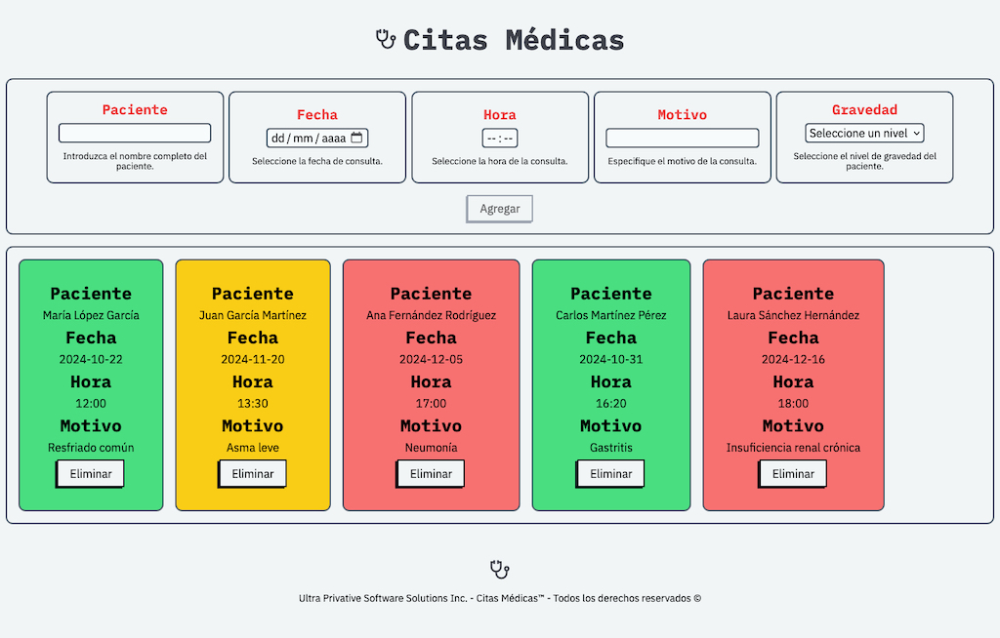
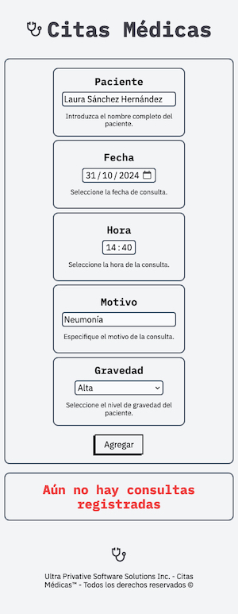

# Desafío Citas Médicas 🧑🏻‍⚕️👨🏽‍⚕️

Este proyecto forma parte de un desafío técnico, desarrollado con **Vue.js**, con el objetivo de crear una aplicación interactiva y modular para la gestión de citas médicas. A continuación, se detallan las principales características que se implementaron:

### Características del Proyecto:

- **Interactividad Dinámica:** Se utilizaron eventos y modificadores de Vue.js para agregar una experiencia interactiva y fluida a la aplicación.
- **Componentes Reutilizables:** Se aprovechó la modularidad de Vue mediante la reutilización de componentes, optimizando el desarrollo y mejorando la eficiencia.
- **Comunicación entre Componentes:** Implementación de `props` para el paso de datos entre componentes, y la emisión de eventos para la comunicación entre componentes hijo y padre.
- **Manipulación Dinámica de Estilos:** Los estilos de la interfaz se ajustan en respuesta a los eventos emitidos por los usuarios, proporcionando una experiencia de usuario personalizada.
- **Modernización de Estilos:** Se integró **Modern Normalize** para asegurar la consistencia visual de la aplicación en diferentes navegadores.

El diseño de la aplicación está inspirado y basado en [este recurso](https://fullstackopen.com/es/), adaptando las mejores prácticas para crear una interfaz limpia y accesible.

### 👉 [Ver el resultado final](https://desafio-citas-medicas-nine.vercel.app/)

## Otra captura:

- Versión móvil:

 
